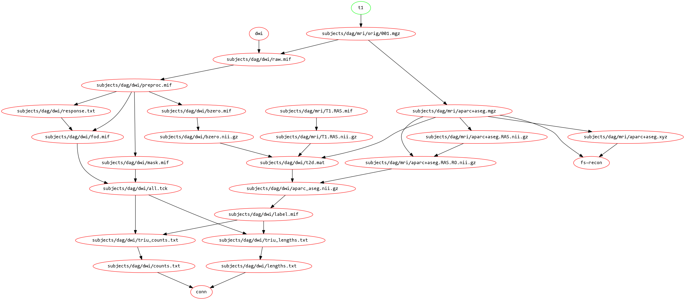

# tvb-make

This is a Makefile and supporting Python module for preprocessing structural data
for TVB brain models. The dataflow implemented can be seen in the following diagram:



## Usage

```bash
source activate

# make freesurfer recon, tractography and connectome
make SUBJECT=ac-p15 T1=data/t1/epi2009/ac-p15 DWI=data/dti/epi2009/ac-p15 fs-recon resamp-anat tck conn

# reconstruct electrodes
make SUBJECT=ac-p15 ELEC=data/ct/ac-p15.nii.gz elec_mode=ELEC labeled_elec
```

The `run-one.sh` script can be used with OAR to run many jobs, e.g.
```bash
oarsub -l nodes=1,walltime=24:00:00 --array-param-file params.txt ./run-one.sh
```

## Dependencies

- Python w/ NumPy, SciPy, NiBabel
- FreeSurfer 6
- FSL
- MRtrix3 (>= v0.3.15)

DCMTK is optionally used to decompress lossless JPEG compressed DICOM images.

For some rationale for using `make`, cf http://zmjones.com/make/
